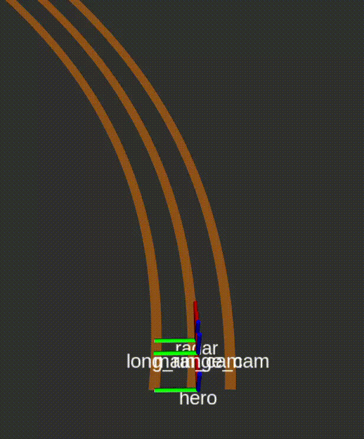

## Path Finder ROS2

ROS2 C++ node responsible for fusing the outputs of EgoPath and EgoLanes and deriving the shape of the driving corridor and the relative position of the vehicle with respect to the driving corridor. It takes in labelled EgoLane and EgoPath detection relative to ego vehicle frame from Birds-Eye-View perspective and tracks error metrics (cross-track error, yaw error, curvature and corridor width) in BEV metric coordinates using Bayes filter. These error metrics will be utilized by a downstream steering controller.

## Dependencies
- C++17
- Eigen3
- OpenCV2

## How it works

### Filter Implementation
The following measures are taken to ensure robust estimation of
1. Cross-Track Error: The width of the driving corridor is tracked by the filter so that when EgoPath is not available, CTE can be derived from immediate left/right EgoLanes CTE through offsetting by half of the width. A fused CTE is also available through the Gaussian product of individually tracked CTEs (i.e. EgoPath, left EgoLane, right EgoLane).
2. Yaw error & Curvature: Fused left and right EgoLanes Yaw error & Curvature to reduce the effect of perspective warping from the flat ground plane assumption. 

## Subscription
Driving corridor, can be simulated using `road_lane_publisher_node` from `road_lane_publisher` package under `Simulation` folder
- /egoPath (`nav_msgs/Path`)
- /egoLeft (`nav_msgs/Path`)
- /egoRight (`nav_msgs/Path`)
  

## Publisher
Value tracked by Bayes Filter
- /pathfinder/tracked_states (`Float32MultiArray`)

Visualization for tracked states
- /pathfinder/egoPath (`nav_msgs/Path`)
- /pathfinder/egoLeft (`nav_msgs/Path`)
- /pathfinder/egoRight (`nav_msgs/Path`)